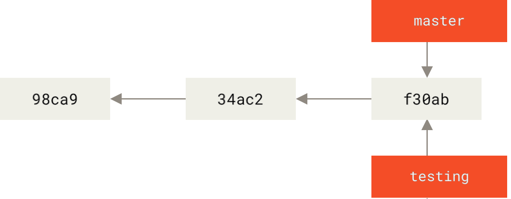
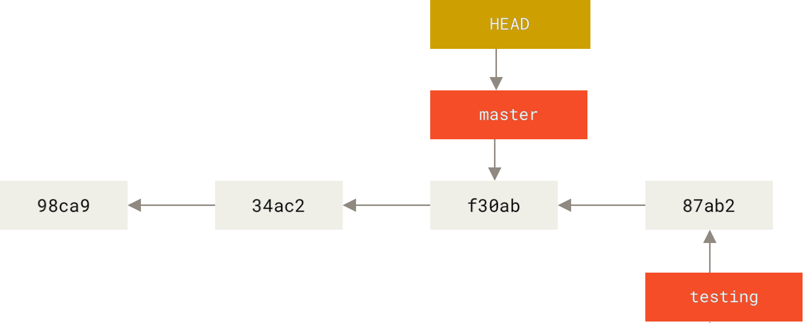
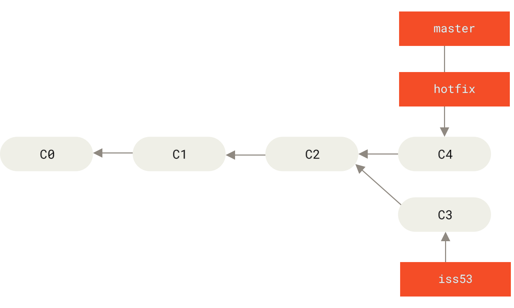
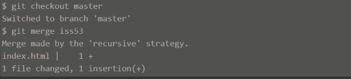
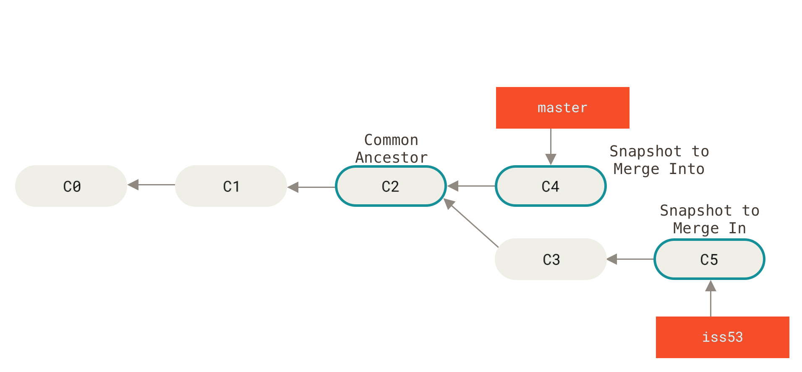
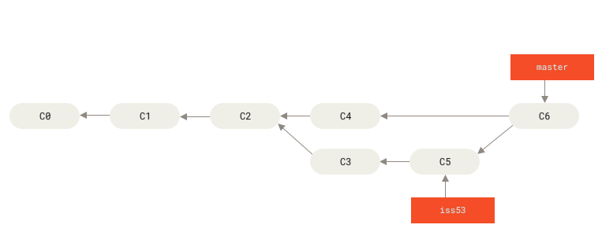

## Branching:
A `branch` is a small movable pointer that refers to a commit.

* Branching means creating a seperate line of development from the main line.

* For example you  need to add a feature to your project:
  You can create a branch for that
```SH
  $  git branch payment-feature
```

**The main purpose of branching is isolation**:
→ The stable code remains undisturbed
→ You can experiment safely
→ You can work on several tasks independently
→ You can later combine the work through mergin.


* To create a new branch
```sh
    $ git branch testing
```
It creates a branch but it doesnt switch to automatically, use this to do it
```sh
    $ git switch -c testing
```
And if you already have a branch but not switch to it yet, 
```sh
  $ git checkout testing
```
#### Viewing all branches and divergence
```sh
    $ git log --oneline --decorate --graph --all
```

→ `--oneline` displays each commit compactly
→ `--decorate` displays branch names and `HEAD`
→ `--graph` draws an ASCII graph showing relationships
→ `all` includes commits reachable from all local branches.


#### The complete mental model is:
`HEAD → current branch → latest commit → parent commit → earlier commit`

**When you:**
* Create a branch, Git creates another pointer to a commit.
* Switch branches, Git moves `HEAD` and updates your working directory.
* Commit, the current branch pointer moves forwad.
* Work on two branches independently, their histories diverge
* View the graph, Git shows how those pointers and commits relate
* Merge later, Git uses the record parent relationships to combine the lines development.


## Basic Branching and Merching:


You can run your tests, make sure the the `hotfix` is what is you want, and finally merge the `hotfix` back to your `master` branch to deploy to production

```shell
  $ git checkout master
  git merge fix
```

So now the master pointer is pointing to the commit that the `hotfix` branch is pointing to previously


Now you can simpley delete it, because you no longer need it
`git branch -d hotfix`

* Now you can switch back for example, to your `iss53` branch and continue working on it.
  


### Basic Merging
If you've decided that your `iss53` work is complete and ready to be merged into your `master` branch. You will merge your `iss53` branch into `master` much like the `hotfix` merging.
*All you have to do is check out te branch you wish to merge into and then run `git merge` command.*


→ In this case, your development history has diverged from some older point. Because the commit on the branch you're on isn't a direct ancestor of the branch you're merging in.
Git has to do some work. In this case, git does a simple `Three-way merge`, using the two snapshots pointed to by the branch and the ancestor of the two


→ Instead of just moving the branch pointer forward, *Git creates a new snapshot that result from this three-way merge and automatically creates a new commit that points to it.* This is referred to as a `merge commit`, and is special in that is has more than one parent.


Now that you work is merged in, you no further need for the `iss53` branch.


### Basic Merge Conflicts