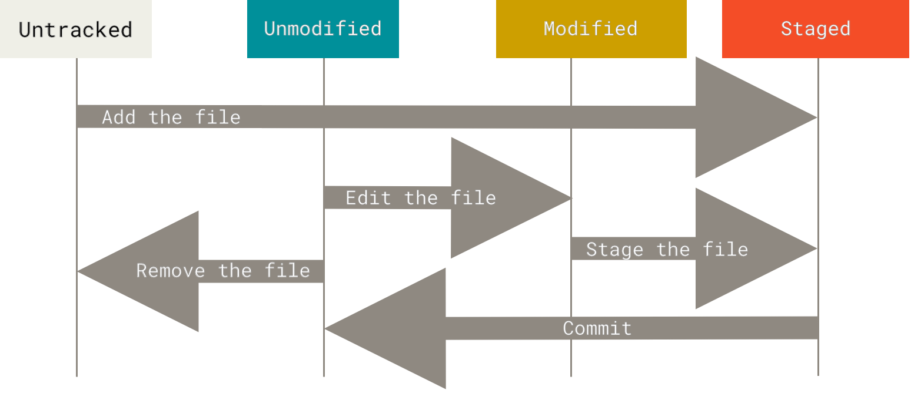

# Git Repository.

Things you have to know at the end of this chapter:
- configure and initialize a repo.
- begin and stop tracking files
- stage and commit changes
- Setting up the Git to ignore certian files, file patterns
- Undo mistakes
- Browsing the history of your project, view changes between commits
- How to push and pull from remote repositories


### You typically optain a Git repo in one of two ways:
1. You can take a local directory that is currently not under version control, and turn it into a Git repo, or
2. You can `clone` and existing Gti repo from elsewhere.

**Initializing a Repo in a Existing Dir**
- First you need to go to that project's directory.
`$ cd C:/Users/my_project` and type `git init`

* This creates new sub directory name `.git` that contains all of your necessary repository files-a Git repo skeleton. 
At this point nothing of your project is tracked.

If you want to start version-controlling existing files, use `git add` commands that specify the files you want to track, follewed by a `git commit`

```Shell
$ git add *.c
$ git add LICENSE
$ git commit -m 'Initial project version'
```

**Cloning a repo using `git clone`**
If you want to contribute a project you need to run this command to get a full copy, and every version of the project. `git clone <url>`

* If you want to clone the repo into a directory named something other than original name, you can specify the new directory name as additional argument.
`git clone https://gtihup.com/libgit2/libgit2 myproject`.

* Git has a number of different transfer protocols you can use. this example uses `https://` but also you can see `user@server:path/to/repo.git`, which uses the SSH transfer protocol.  

### Recording Changes to the Repository
>checkout -> updating your **working copy** files on your local machine to match specific branch, commit, or file version. 

* So our files are either two states:
    - *tracked*: Files that were in the last snapshot, as well as any newly staged files; (unmodified, modified, or stages). In short these are files git knows about.  
    - *untracked*: Any files in your working directory that were not in your last snapshot and are not in your staging area.

* As you edit files, Git sees them as modified, because you've changed them since your last commit. As you work, you selectively stage these modified files and then commit all those staged changes.



### Checking the status of your file:
You can use `git status` to determine which files are in which state.

### Tracking New Files
When you to want to track files you use the command `git add`
```Shell
git add Chapter_2
```

if you run `git status` command you can see that `Chapter_2` file is now tracked and staged to be committed.

```Shell
$ git status
On branch master
Your branch is up-to-date with 'origin/master'.

Changes to be committed:
  (use "git restore --staged <file>..." to unstage)

    new file:   Chapter_2/ch_2_notes.md
    new file:   Chapter_2/image.png
```

You can tell that it's staged because it's under the `Changes to be committed` heading.
* *If you commit at this point, the version of the file at the time you ran `git add` is what will be in the subsequent historical snapshot.*

* You may recall that when you run `git init` earlier, you then ran `git add <files>`- *that was to begin tracking files in your directory.* 
* The `git add` command takes a path name for either a file or a directory; *if it's a directory, the command add all files in that directory recursively.* 


### Staging Modified Files
 If you change a previously tracked file called e.g `Chapter_2` and then run `git status` command, you file appears under a section named `Changes not staged for commit` - which means that a file that is tracked has been modified in the working directory but not yet staged. To stage it run `git add <file>`,
  - `git add` command is a multipurpose command - you use it:
    * to begin tracking new files.
    * to stage files.
    * marking merge-conflict files as resolved, and so on

* If you see `MM` when you run the command `git status`, it means the files was modified, staged, and then modified again, so there are changes to it that are both staged and unstaged.


### ignoring Files:
To ignore certain files in git, you can create a `.gitignore` file listing pattern to match them.

```Shell
  cat .gitignore
  *.[oa]
  *~
```

* There are rules for the patterns you can put in the `.gitignore` file:
  1. Blank lines or lines starting with # are ignored
  2. Standard glob patterns work, and will be applied recursively throught the entire working tree.
  3. You can start patterns with a forward slash(/) to avoid recursivity.
  4. You can end patterns with forward slash(/) to specify a directory
  5. You can negate a pattern by starting it with an exlamation point(!).


`git diff` is more detailed command then `git status` command, because it shows to you the exact lines you have added and removed - the `patch`.

* The command compares what is in your working directory with what is in your staging area.
The result tells you the changes you've mad that you haven't yet staged..


### Committing Your Changes.
* Important point in this section is, anything that is still unstaged - you have created or modified and you haven't run `git add` on since you edited them - won't go into this commit. They will stay as modified files on your disk.

The command for committing changes is `git commit`.


